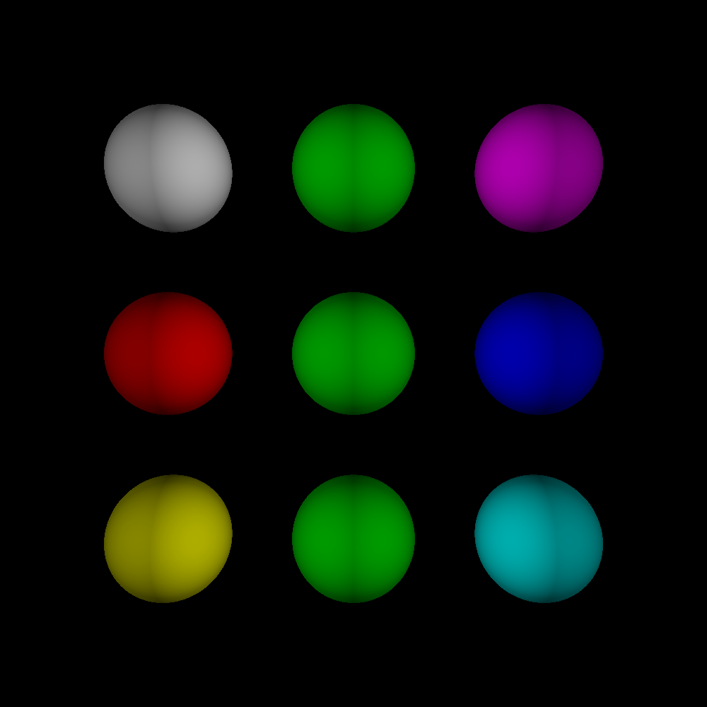
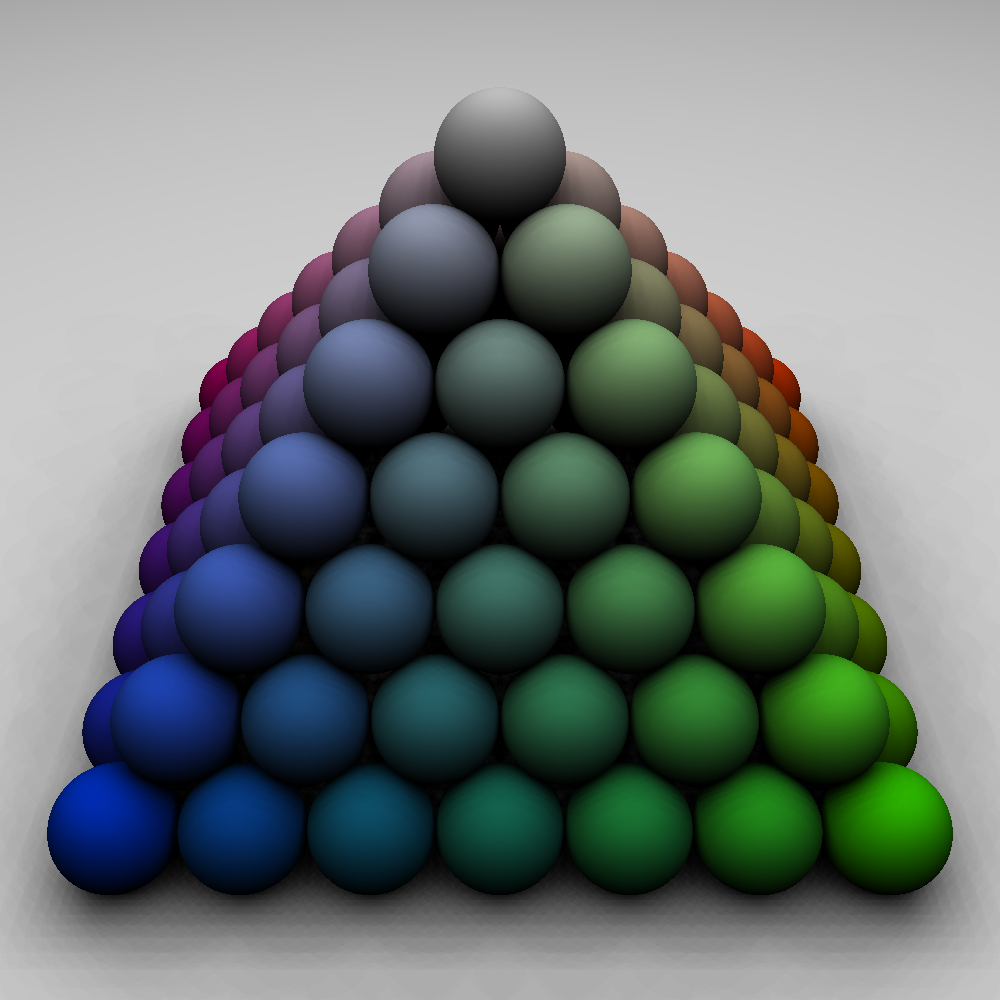
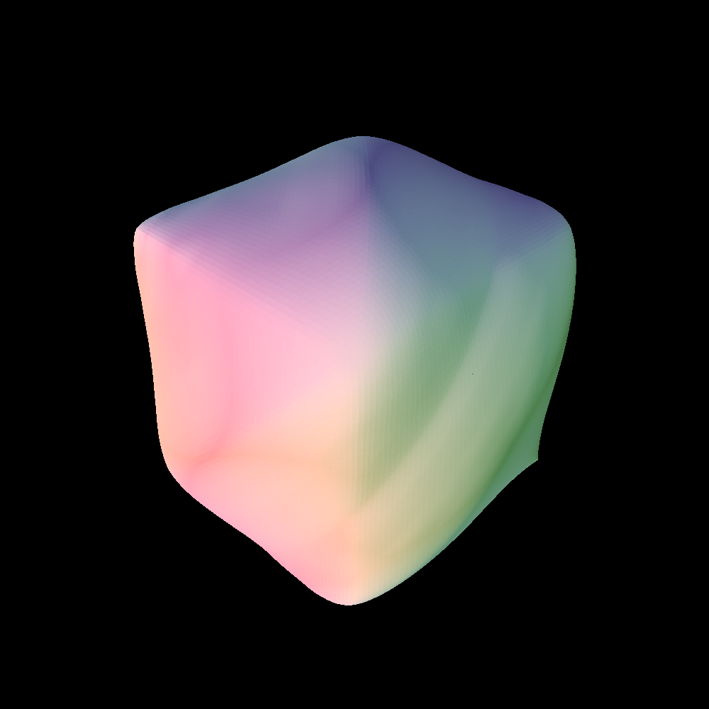

<style>
/* General styles for all headers */
h1, h2, h3, h4, h5, h6 {
    font-family: 'Arial', sans-serif; /* Change font family as needed */
    color: #333; /* Dark gray color for better readability */
    margin: 0.5em 0; /* Margin for spacing */
    border: none;
}

/* Specific styles for each header level */
h1 {
    font-size: 2.5em; /* Larger size for main headers */
    border-bottom: 2px solid #ccc; /* Underline for emphasis */
}

h2 {
    font-size: 2em; /* Medium size for sub-headers */
    color: #555; /* Slightly lighter gray */
}

h3 {
    font-size: 1.5em; /* Smaller size for sub-sub-headers */
    color: #777; /* Even lighter gray */
}

h4 {
    font-size: 1.2em;
    font-weight: bold; /* Make it bold for emphasis */
}

h5, h6 {
    font-size: 1em; /* Smallest size for minor headers */
    font-style: italic; /* Italics for differentiation */
}

</style>


lanuch.vs.json [setting for command line arguments]
```c++
{
  "version": "0.2.1",
  "defaults": {},
  "configurations": [
    {
      "type": "default",
      "project": "CMakeLists.txt",
      "projectTarget": "mproject.exe (mproject\\mproject.exe)",
      "name": "mproject.exe (mproject\\mproject.exe)",
      "args": ["--scene", "mesh.scene", "--obj", "subdiv.obj", "--threads", "12", "--shadow"]
    },
  ]
}
```

command line arguments

```
--scene <string:scene_file_name>
--obj <string:obj_file_name> [optional] 
--out <string:out_file_name> [optional] [default: "output.bmp"]
--threads <int:number_of_threads> [optional] [default: <all_cores_available>]
--width <int:width_of_image> [optional] [default: 1000]
--height <int:height_of_image> [optional] [default: 1000]
--no-shadow [optional]
```

configure file

```c++
#define CHECK_CMAKE false
```


output exmaple
> basic


> spheramid


> mesh



----------

<h2>Profiling</h2>

<h3>Shpheramid:</h3>

```
>>> SHADOW [false]
Total render time: 1.431968 seconds  
Average time per pixel: 0.000001 seconds  
Total lighting calculation time: 0.643970 seconds  
Average lighting calculation time per pixel: 0.000001 seconds 
```
```
>>> SHADOW [true]
Total render time: 20.180865 seconds  
Average time per pixel: 0.000018 seconds  
Total lighting calculation time: 18.221199 seconds  
Average lighting calculation time per pixel: 0.000018 seconds  
```


<h3>mesh:</h3>

```
Total render time: 267.880153 seconds  
Average time per pixel: 0.000266 seconds  
Total lighting calculation time: 0.029447 seconds  
Average lighting calculation time per pixel: 0.000000 seconds  
```


----------

<h2>Basic CPU Multi Threading</h2>

<h3> Spheramid multithreading output would be: </h3>

```
number of threads: 12
Thread 0 execution time: 4.64883 seconds
Thread 1 execution time: 4.61504 seconds
Thread 2 execution time: 4.72122 seconds
Thread 3 execution time: 4.78215 seconds
Thread 4 execution time: 4.71916 seconds
Thread 5 execution time: 4.57796 seconds
Thread 6 execution time: 4.4709 seconds
Thread 7 execution time: 4.39865 seconds
Thread 8 execution time: 4.29523 seconds
Thread 9 execution time: 3.66754 seconds
Thread 10 execution time: 2.78233 seconds
Thread 11 execution time: 3.80514 seconds
Total render time: 4.794441 seconds
```

<h3> Mesh multithreading output would be: </h3>

```
scene file: mesh.scene
obj file: subdiv.obj
num threads: 12
width: 1000
height: 1000
shadow: true

Thread 0 execution time: 34.7879 seconds
Thread 1 execution time: 35.2287 seconds
Thread 2 execution time: 35.4175 seconds
Thread 3 execution time: 34.9558 seconds
Thread 4 execution time: 35.4999 seconds
Thread 5 execution time: 34.0669 seconds
Thread 6 execution time: 34.3035 seconds
Thread 7 execution time: 34.5124 seconds
Thread 8 execution time: 34.281 seconds
Thread 9 execution time: 34.598 seconds
Thread 10 execution time: 34.4974 seconds
Thread 11 execution time: 36.2338 seconds
Total render time: 36.255803 seconds
```